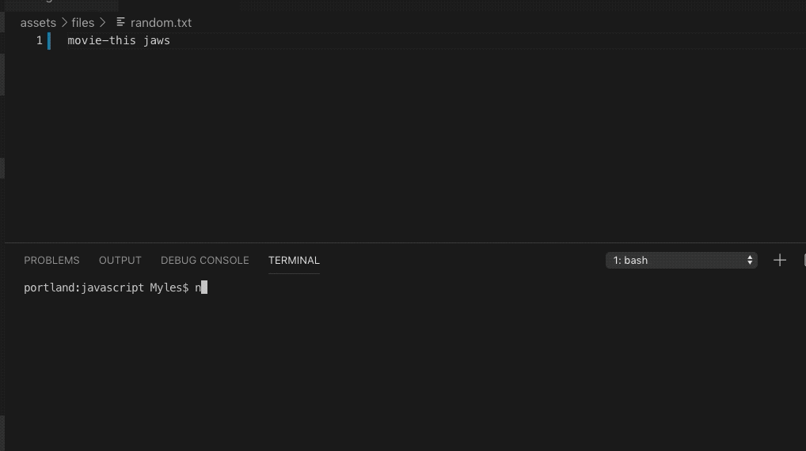
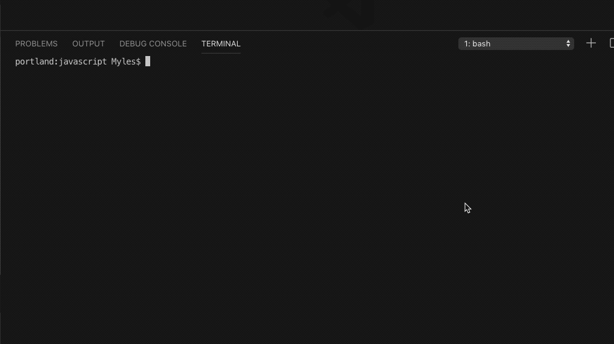
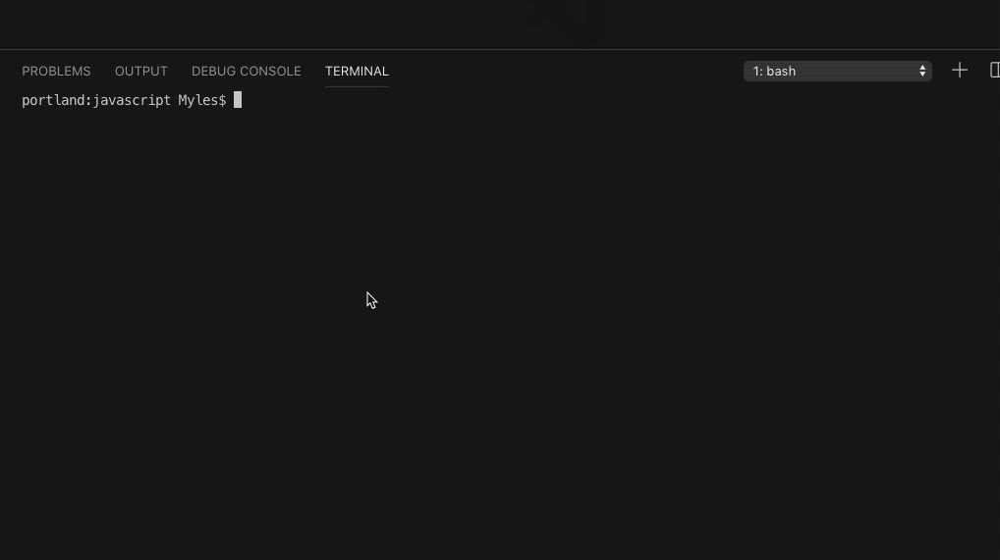
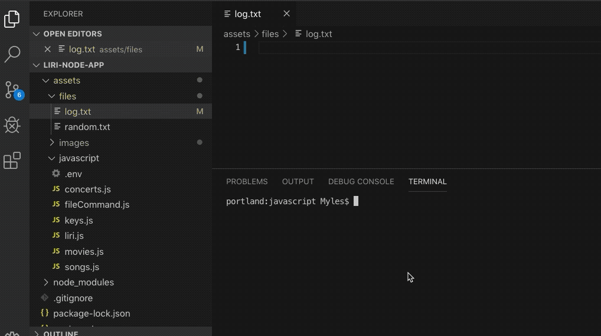

## (Language Interpretation and Recognition Interface)

Node.js app for song, movie, concert search

## Description

This node app retrieves API data for the user based on input and command selection.

Available data includes songs from Spotify, movies from OMDB and concerts from Bands in Town.

## Test Cases

Functionality Cases
1. Valid command / Valid parameter
    1. expect movie listings
        1. movie-this the martian
        2. movie-this interstellar
    2. expect concert listings
        1. concert-this son volt
        2. concert-this superchunk
        3. concert-this poster children
    3. expect song listings
        1. spotify-this the golden state
        2. spotify-this my way
        3. spotify-this loser   

Results: 

1. Functional Cases - Continued
    1. expect do-what-it-says to read random.txt file and process its command
        1. movie-this jaws - expect movie listings
        2. concert-this the killers - expect concert listings
        3. spotify-this detroit has a skyline too - expect song listings    
        4. if parameter missing - expect default parameter to be employed - see 2.1 below  
        5. do-what-it-says  - will prompt user if they meant closet match
            1. which will be concert-this and will not have a parameter - see 2.1 below
        6. Refactor-To-Do:  liri will not gracefully handle a missing random.txt file

Results: 

2. Valid command / missing parameter
    1. expect default parameter values to be applied
        1. movie-this   - expect:  mr. nobody
        2. concert-this - expect:  bon jovi
        3. spotify-this - expect:  if you see kay

Results: 

3. Command Typo - Best Match logic
    1. mis-type the command and string-similarity npm package with prompt with best guess
    2. move-dis the martian - expect: Did you mean:  movie-this the martian (Y/n)
        1. Y will then run the corrected command
        2. N will display a list of valid commands and terminate
    3. test above for examples such as:  spofly-thsi   and   cncert-tjs 

Results: 

3. Logs
    1. check log.txt - all commands will be logged wih their respective output
    2. remove log.txt and test - new log.txt should be created

Results: 

​    

​    

4. Edge Cases
    1. Refactor-To-Do - movie-this, concert-this will not gracefully handle a parameter that 
      that cannot be found:  for example: 
       movie-this thisdoesnotexist  and concert-this thisdoesnotexist

